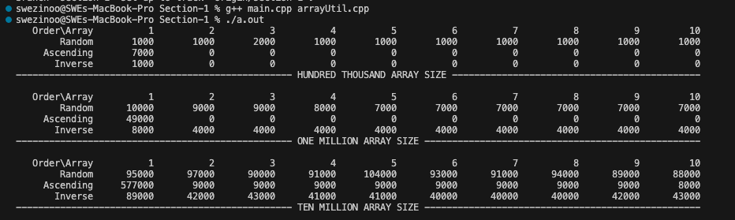
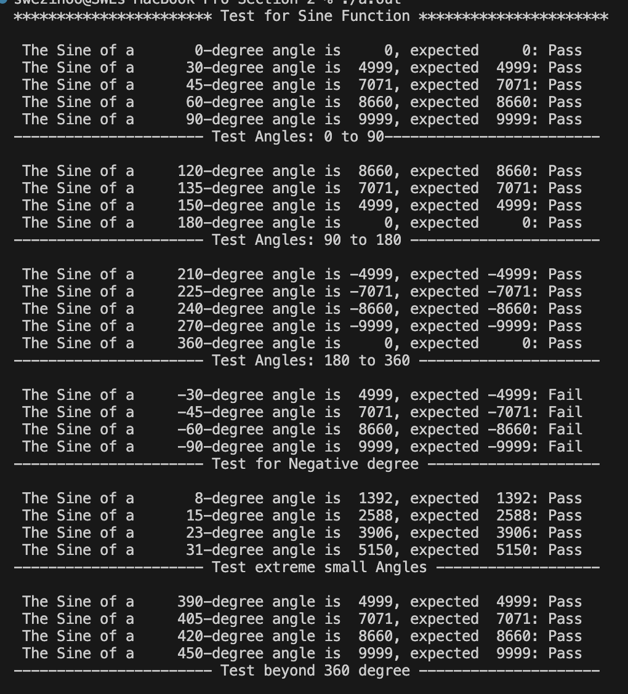

# Getting Started

## Build With
The c++ program is built using Visual Studio Code on MacOS.

## Prerequisites 
1. An integrated development environment (IDE) capable of running c++ programs, such as CLion, Visual Studio Code and Eclipse installed.
2. Mac OS or Window OS.
3. An internet connection to check out the project from the repository.

## Installation
1. Clone the repo
    git clone https://github.com/swezinooszo/cs700-a3.git

# Section-1
# About The Project

The program aims to measure the time required for sorting arrays in different orders and sizes. It employs sorting orders including random, ascending, and reverse, focusing primarily on three array sizes: Hundred Thousand, One Million, and Ten Million. The program presents a figure illustrating the execution time per array size, where ten arrays undergo sorting in three different orders for each array size. Execution times are measured in microseconds.

# Usage
Please follow the below steps to run the program:
 
1. Open Section-1 project from IDE
2. Run the command in terminal 
    - g++ main.cpp arrayUtil.cpp -o main
    - ./main
  
# Sample Output
The figure below illustrates the execution times for ten arrays of different sizes (Hundred Thousand, One Million, Ten Million), sorted randomly, in ascending order, and in descending order.

# External Document
The location of the external document is cs700-a3/Section-1/doc/html/index.html

# Section-2
# About The Project

The purpose of this program is to perform white-box testing on the existing sine and cosine functions to ensure their accuracy across various angles. These straightforward functions compute the sine and cosine values of an angle, presenting the output in ten-thousandths.

To ensure the program's functionality, we will test both functions across angles ranging from 0 to 360 degrees. Specifically, we'll examine 14 angles, including key angles like 0, 30, 45, 60, 90, 180, and 270. Subsequently, we'll compare the actual values with the expected ones and display the test results as either pass or fail.

Verifying negative values is a crucial aspect of white-box testing, ensuring the program appropriately handles negative input. Thus, test cases for different negative angles will be executed and verified.

Furthermore, extreme small values, such as 8, 15, 23, and 11 degrees, will undergo testing and validation to detect any potential overflow or underflow concerns.

Finally, test cases encompassing angles beyond 360 degrees, such as 390, 420, and 450, are integrated into this white-box testing to guarantee the proper handling of values beyond a single cycle by the functions.

# Usage
Please follow the below steps to run the program:
 
1. Open Section-2 project from IDE
2. Run the command in terminal 
    - g++ sin_cos.cpp -o main
    - ./main
  
# Sample Output
A white-box test result for testing sine and cosine functions with different test cases.

#### Sine Function

#### Cosine Function

# External Document
The location of the external document is cs700-a3/Section-2/doc/html/index.html

# Contact
[swezinoo410@gmail.